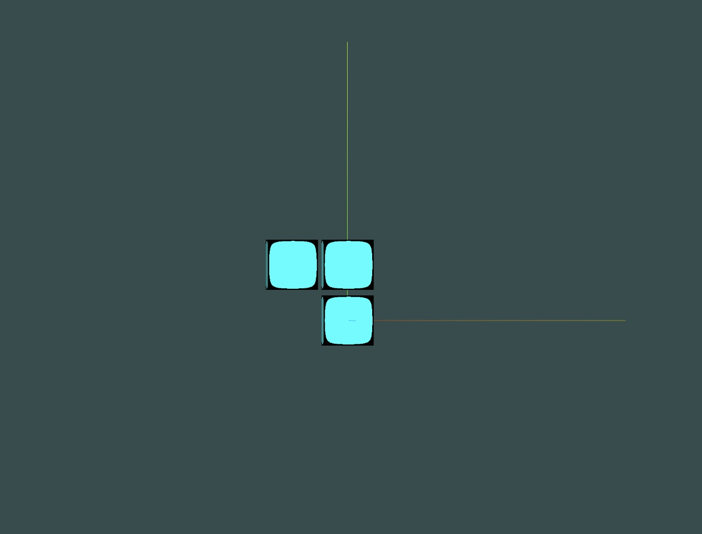
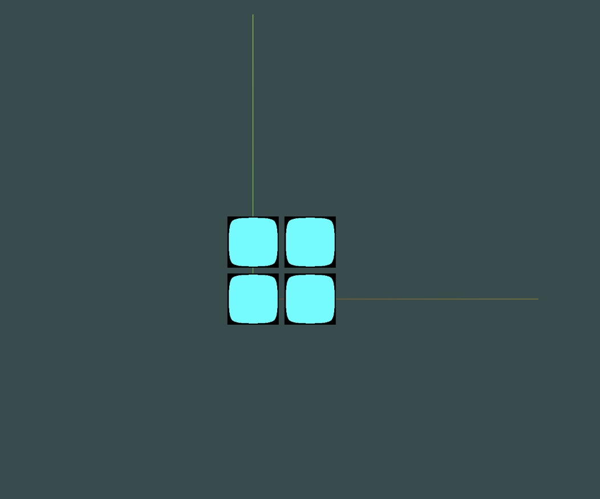

# The Enumerator

The enumerator generates all distinct polyominoes (2D) or polycubes (3D) that fit within a given set of dimensions in the form of JSON files. Each JSON file represents a unique configuration that fits the bounding box with a set of specified dimensions. 

## For example, if the specified dimensions are 2x2, then the polyominoes that fit the bounding box are: 

The enumerator outputs a set of free polyominoes or free polycubes; none of the outputted configurations can be transformed into any other via rotation, reflection, or translation.   

The generated JSON files can be fed into Webvis or Pathfinder and can serve as metamodules for complex modular robotic configurations. Within the context of modular robotics, each square unit within a configuration serves as a module.  

## Implementation 

The Enumerator is implemented recursively through Redelmeier's Algorithm, but specifically modified to enumerate the number of configurations that fit within a bounding box of a given set of dimensions. 

If the given set of dimensions are 3x2, then the configurations grow within a contained 2-Dimensional box that is 3 units long and 2 units wide.

If the given set of dimensions are 3x2x2, then the configurations grow within a contained 3-Dimensional box that is 3 units long, 2 units wide, and 2 units high. 

### The Enumerated Polyominoes 

The algorithm to generate the polyominoes that are L x W (for a given L and W) maps the modules upon a cartesian plane, starting with the first module on the origin point (0,0). The origin is treated as the bottom left-hand corner of the configuration; no modules can be placed below or to the left of the origin. 

From there, the configuration recursively grows by adding modules to the unvisited neighboring spots of the current modules on the configuration. A module cannot be placed upon a point more than once, preventing overcounting. 

When the width or the length of the bounding box has been reached, the enumerator stops growing in that direction. When the width AND the length are reached for a configuration, a JSON representation of it will be written to the directory. 

Any transformations of polyominoes that are already outputted are pruned off; the output strictly writes a set of free polyominoes to your directory. 

### The Enumerated Polycubes 

The algorithm to generate the polycubes that are L x W x H (for a given L, W, and H) is implemented with the same logic; only now, the height is accounted for. 

The first module is placed at the origin (0,0,0), which serves as the minimum cell under a lexicographic ordering (y, then z, then x); no point that precedes the origin may be used. 

There are 48 possible transformations for a polycube, but this algorithm offers an optimized way of pruning all transformations. There are 8 possible sign changes (Ex: (x,y,z) to (-x,y,z)... etc), and 6 possible permutations of (x,y,z) (Ex: (x,y,z), (y,x,z), etc).

The program cleanly iterates through these combinations to go through every possible transformation to prune out any rotations or reflections. Translations are handled by normalizing each configuration before checking for rotations or reflections. 

## Scripts

- `enumerator_2D_free.py` — 2D polyominoes
- `enumerator_3D_free.py` — 3D polycubes

## Usage

Run either script as a command line program, and enter the dimensions when prompted. The program writes the output to your current directory, in the format expected by the metamodule processor. 

The outputted JSON follows the structure of modular robotic configurations highlighted in Pathfinder. 

## References

- Redelmeier, D. H. (1981). *Counting polyominoes: Yet another attack.* Discrete Mathematics, 36(2), 191–203.